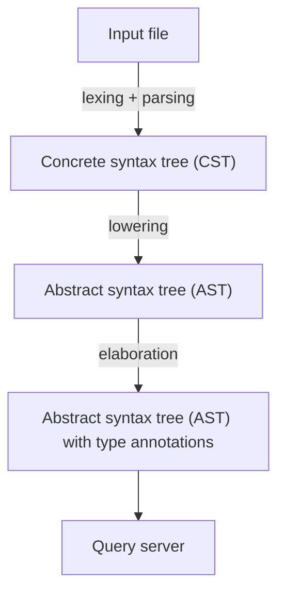
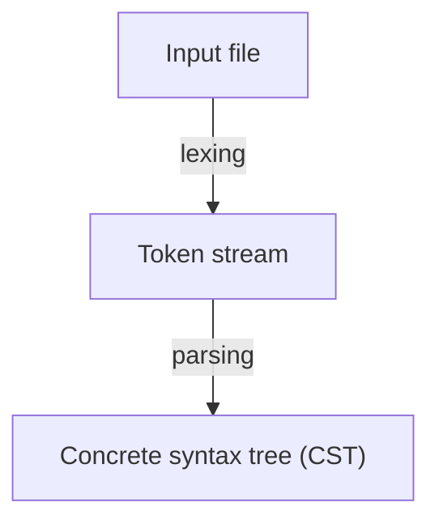

# Architecture of the Polarity Compiler

Following the recommendation of [matklad](https://matklad.github.io/2021/02/06/ARCHITECTURE.md.html), this file provides a high-level overview of the structure of the polarity compiler.

## The compiler pipeline

The basic compiler pipeline looks as follows:

##  Lexical analysis

The first step from the input file to the concrete syntax tree is defined in the `lang/parser` crate.
That crate contains the definition of the concrete syntax tree and separate lexers and parsers.
The lexer is written using the [logos](https://crates.io/crates/logos) lexer generator, and the parser is written using the [lalrpop](https://crates.io/crates/lalrpop) parser generator.
The language is whitespace insensitive, and the parser is rather dumb on purpose; it tries to accept a superset of valid programs, and a lot of syntactically invalid programs are only rejected in the lowering phase.
The concrete syntax tree (CST) only contains the concrete names of identifiers and variables that occur in the source text, and does not attempt to analyze the binding structure of the program.

## Lowering

The lowering phase is defined in the `lang/lower` crate and lowers the concrete syntax tree (CST) to an abstract syntax tree (AST).
The abstract syntax tree itself is defined in the `lang/syntax` crate.
The lowering phase takes care of the following tasks:

- Representing the binding structure of the program using de Bruijn indizes.
  The AST uses de Bruijn indizes to represent the binding structure of locally bound variables. The concrete names that the programmer wrote are preserved, however, since they are needed for various diagnostics and editor services.
- Name resolution for declarations at the toplevel. We check that every occurrence of a name in an expression refers unambigously to some declaration at the toplevel
- Arity checks for type constructors, constructors, functions, destructors etc.
  Toplevel entities are in general not curried, for this reason we check whether the right number of arguments has been provided for them, which leads to improved error messages compared to systems which use widespread currying.
- Generate fresh meta-variables for typed holes in the user program and for implicit arguments.

## Elaboration

Elaboration is defined in the `lang/elaborator` crate.
The elaborator takes an abstract syntax tree and returns a typechecked and elaborated abstract syntax tree which is annotated with typing information for each syntax node.
We do use the same type for both the un-elaborated and the elaborated syntax tree, however.
The elaborator itself consists of three parts:
- A unification algorithm defined in `lang/elaborator/src/unifier`.
- A bi-directional typechecker defined in `lang/elaborator/src/typechecker`.
- Untyped normalization-by-evaluation (NbE) defined in `lang/elaborator/src/normalizer`.

